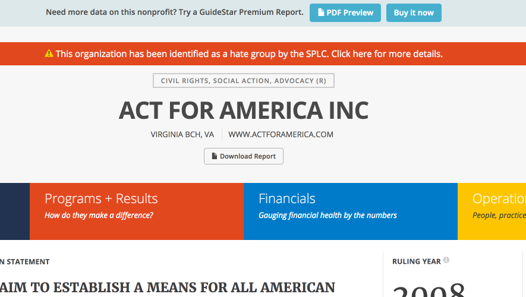

# identify hate

  

[GuideStar](http://guidestar.org/) added [SPLC information](https://www.splcenter.org/)
identifying nonprofits run by [hate groups](https://www.splcenter.org/fighting-hate/extremist-files).
They [were pressured to remove that information](https://www.washingtonpost.com/news/morning-mix/wp/2017/06/26/after-conservative-backlash-charity-tracker-guidestar-removes-hate-group-labels/).
This extension adds that information back.

## Help out

* I'd really appreciate any help associating any of the [not found](not-found.md)
  organizations with GuideStar pages
* Would also love help proofing the data that exists in [inject.js](ext/src/inject/inject.js),
  to make sure all the matches are accurate.

## Like this project?

[Donate to the Southern Poverty Law Center!](https://donate.splcenter.org/page.aspx?pid=463)

## Disclaimers

* This project is not associated with or endorsed by the SPLC or GuideStar
* Information is not guaranteed to be accurate: matches are made between
  the two sites based on name, date of formation, place, and staff listings.
